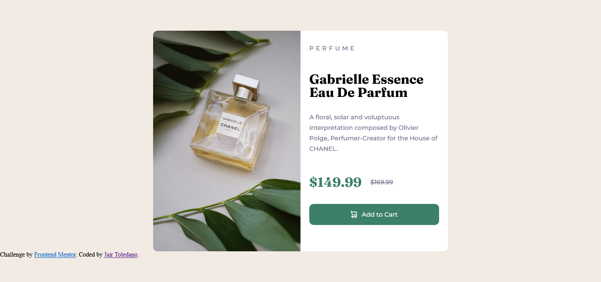

# Frontend Mentor - Product preview card component solution

This is a solution to the [Product preview card component challenge on Frontend Mentor](https://www.frontendmentor.io/challenges/product-preview-card-component-GO7UmttRfa). Frontend Mentor challenges help you improve your coding skills by building realistic projects. 

## Table of contents

- [Overview](#overview)
  - [The challenge](#the-challenge)
  - [Screenshot](#screenshot)
  - [Links](#links)
- [My process](#my-process)
  - [Built with](#built-with)
  - [What I learned](#what-i-learned)
  - [Continued development](#continued-development)
  - [Useful resources](#useful-resources)
- [Author](#author)

## Overview

### The challenge

Users should be able to:

- View the optimal layout depending on their device's screen size
- See hover and focus states for interactive elements

### Screenshot




### Links

- Solution URL: [Add solution URL here](https://your-solution-url.com)
- Live Site URL: [Add live site URL here](https://your-live-site-url.com)

## My process
  first I design the mobile version, then scaled to the desktop version.

### Built with

- Semantic HTML5 markup
- CSS custom properties
- Flexbox
- Mobile-first workflow


### What I learned

During this project I strengthened my knowledge of flex design.
I'm proud of how the cart button turned out

To see how you can add code snippets, see below:


```#cart-btn{
    display: flex;
    align-items: center;
    justify-content: center;
    border: none;
    border-radius: 10px;
    background-color: var(--Dark-cyan);
    color: var(--White);
    font-family: 'Montserrat', sans-serif;
    margin-bottom: 10px;
    }
```

### Continued development

I want to continue learning about flex design and grid, because I feel that I still don't take advantage of all the potential that they can give me as a frontend developer.
Also, feel that I'm redundant with my CSS. I think i can make it more ordered and clean.

### Useful resources

- [CSS Reference](https://cssreference.io/) - This helped me This page helped me with everything related to CSS.

## Author

- GitHub - [HeroYayo](https://github.com/HeroYayo)
- Frontend Mentor - [@HeroYayo](https://www.frontendmentor.io/profile/HeroYayo)


